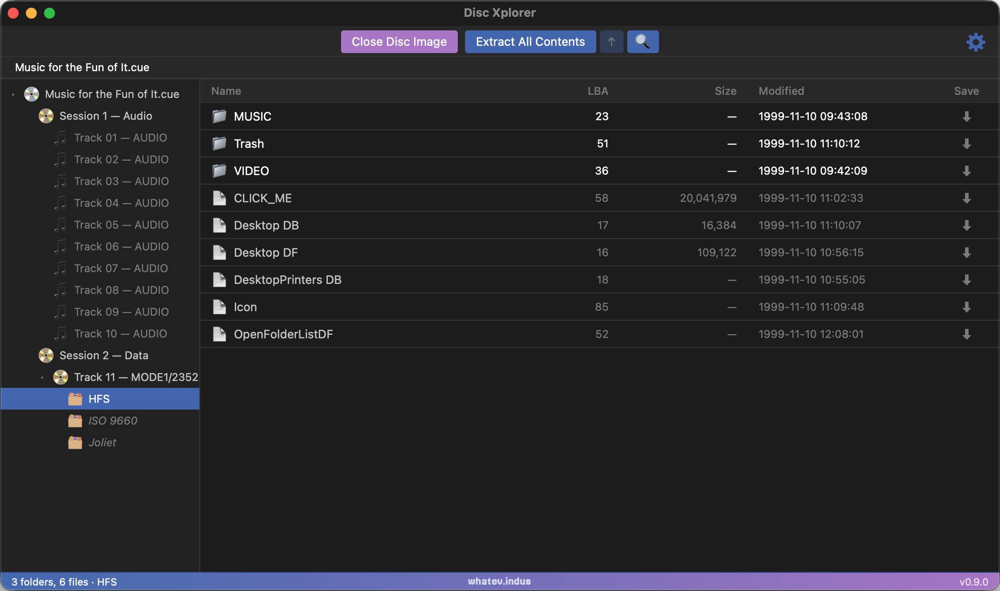

# Disc Xplorer

A cross-platform disc image browser and file extractor. Open a disc image, browse its filesystem, and pull out individual files or entire folders — no mounting required. Think ISOBuster or PowerISO, but native, free, and open source.

Runs on macOS, Windows, and Linux.



---

## Features

### Disc image formats

| Format | Notes |
|--------|-------|
| ISO / IMG | Raw 2048-byte and raw 2352-byte sector images |
| CUE/BIN | Single-file and multi-file (one BIN per track) |
| MDS/MDF | Alcohol 120% images |
| MDX | DiscJuggler images |
| NRG | Nero Burning ROM images |
| CCD/IMG/SUB | CloneCD images |
| CDI | DiscJuggler CDI |
| GDI | Sega Dreamcast GD-ROM images |
| CHD | MAME/RetroArch compressed hard-disk images |
| CSO / CISO | Compressed ISO (PSP / PS2) |
| ECM | Error Code Modeler compressed images |
| WBFS | Wii Backup File System container images |
| WUX / WUD | Wii U disc images (WUX is the deduplicating compressed variant) |
| PS3 ISO | PlayStation 3 disc images (encrypted or decrypted) |
| BlindWrite 5/6 | BlindWrite BWT/B5T/B6T images (with B5I/B6I data file) |
| UIF | MagicISO compressed images |
| CIF | Easy CD Creator disc images |
| AaruFormat | Aaru / DiscImageChef .aif images |
| Redumper | Redumper raw DVD/BD dumps (.sdram/.sbram) |
| Skeleton / Skeleton.zst | Disc images with zeroed file data; zstd-compressed variant supported |
| CDR / DMG | macOS disc images (mount via hdiutil) |

### Filesystems

| Filesystem | Systems |
|------------|---------|
| ISO 9660 + Joliet | Standard PC CD/DVD |
| UDF | DVD-Video, Blu-ray, modern optical media |
| HFS | Classic Mac OS discs |
| PC/Mac hybrid | Dual-filesystem discs with both ISO 9660 and HFS partitions |
| XDVDFS | Original Xbox and Xbox 360 game discs |
| FATX / XTAF | Xbox and Xbox 360 hard-drive and dev-drive images |
| 3DO OperaFS | 3DO Interactive Multiplayer |
| PC Engine CD-ROM | NEC PC Engine / TurboGrafx-16 |
| CD-i | Philips CD-i |
| GCM | Nintendo GameCube and Wii optical discs |
| Wii U | Wii U disc filesystem, including GM partition decryption (Common Key required) |

### Browse and extract

- Navigate the full directory tree of any supported disc image
- Extract individual files or entire directory trees to any destination
- No mounting required — all reads go directly through native Rust parsers

### Audio tracks

- View multi-track disc layouts with track numbers, durations, and sizes
- Export audio tracks as **WAV**, **MP3** (LAME), or **FLAC**

### Conversions

- **PlayStation 3** — encrypt or decrypt PS3 ISOs in-app; choose any output location
- **Wii U** — repackage `.wux`/`.wud` images to `.wud` or `.iso`
- Conversions run as queued jobs with progress and can be cancelled mid-run (partial output is cleaned up)

### Sector viewer

- Inspect raw sector data at any LBA
- Displays sector format (Mode 1/Mode 2), MSF address, and hex + ASCII content
- Open the viewer integrated in the main window or as a pop-out window (configurable in Settings)

### Mounting

- Mount disc images directly from the UI
- macOS: `hdiutil` (ISO, IMG, DMG, CDR)
- Windows: PowerShell `Mount-DiskImage` (ISO, IMG)
- Linux: CDemu virtual drive (CUE, MDS, MDX, NRG, CCD, and more); prompts to install if not present

### Physical drives

- Lists connected optical drives
- Open and browse physical discs the same way as image files
- Eject drives from the UI
- **Dump Disc** — create accurate disc image dumps via [redumper](https://github.com/superg/redumper) (bundled automatically; switch to an external binary in Settings)

### General

- Drag-and-drop to open disc images
- Light and dark themes
- Cross-platform: macOS (ARM + Intel), Windows, Linux

---

## Compared to other tools

| | Disc Xplorer | ISOBuster | PowerISO | Alcohol 120% | Daemon Tools |
|--|:--:|:--:|:--:|:--:|:--:|
| Free | ✓ | Partial | Partial | No | Partial |
| Open source | ✓ | No | No | No | No |
| macOS / Linux | ✓ | No | No | No | No |
| No install to browse | ✓ | No | No | No | No |
| Native file extraction | ✓ | ✓ | ✓ | No | No |
| Audio export (WAV/MP3/FLAC) | ✓ | ✓ | ✓ | No | No |
| Sector viewer | ✓ | ✓ | No | No | No |
| Xbox / GameCube / 3DO | ✓ | Partial | No | No | No |
| PS3 encrypt / decrypt | ✓ | No | No | No | No |
| Wii U decrypt + .wux/.wud/.iso convert & compress | ✓ | No | No | No | No |

ISOBuster and PowerISO are the closest feature equivalents. ISOBuster is Windows-only and partially free (file extraction is paywalled beyond a limit). PowerISO is commercial. Alcohol 120% and Daemon Tools are primarily virtual drive tools; file browsing is a secondary feature.

---

## Building

```
npm install
npm run tauri build
```

Requires Rust (stable), Node.js 18+, and the [Tauri prerequisites](https://tauri.app/start/prerequisites/) for your platform.

For development:

```
npm run tauri dev
```

---

## FFmpeg notice

Audio export (MP3/FLAC) uses FFmpeg libraries bundled at build time.
FFmpeg is licensed under the GNU LGPL v2.1 or later — see https://ffmpeg.org/legal.html.

---

## Third-party references

Format documentation for several disc image and filesystem types was cross-referenced against the following projects. Except where noted below, the native Rust parsers in this project are independent implementations derived from the underlying format specifications; no third-party code is included.

**[FATXTools](https://github.com/aerosoul94/FATXTools)** — aerosoul94. The FATX / XTAF filesystem reader (`src-tauri/src/fatx_filesystem.rs`) is a Rust port of this project's FATX volume, directory-entry, and timestamp logic. Licensed MIT — Copyright (c) 2020 aerosoul94.

**[SabreTools.Serialization](https://github.com/SabreTools/SabreTools.Serialization)** — Matt Nadareski. Well-documented C# parsers for a wide range of disc image and filesystem formats. Licensed LGPL-2.1.

**[Aaru](https://github.com/aaru-dps/Aaru)** (`Aaru.Filesystems`, `Aaru.Images`) — Natalia Portillo. Comprehensive disc image preservation tool with format plugins for 70+ filesystem and 76+ image types. Licensed LGPL-2.1 (library components).

**[Wiimms ISO Tools](https://github.com/Wiimm/wiimms-iso-tools)** — Wiimm. Reference implementation for the WBFS container format (`libwbfs`). Licensed GPL-2.0.

**[redumper](https://github.com/superg/redumper)** — superg and contributors. Accurate optical disc dumping tool (C2 error correction, subchannel preservation). Bundled as a sidecar binary; BSD-1-Clause licensed. The redumper binary is not modified; it is downloaded from the official releases at build time and bundled for convenience.
